# Relatório da Atividade 3 - Tarefas e Dockerfile

| Disciplina | Docente | Discente | Data |
| :--------: | :-----: | :------: | :--: |
| Sistemas Operacionais | Leonardo A. Minora | João Vitor B. da Silva | 23/05/2025 |

<br>

## Objetivo da Atividade

> Aprender a usar um **Dockerfile** para criar um ambiente isolado capaz de **compilar e executar código em C**, seguindo os seguintes passos:  
1. Criar uma imagem Docker com as ferramentas necessárias (`gcc` - compilador C).  
2. Mapear um diretório do host (Windows/Linux) para o container (`/app` - diretório).  
3. Compilar e executar programas em C diretamente no container.  

<br>

## Etapa 1 - Criando Dockerfile, Construindo Imagem e Inicializando Container

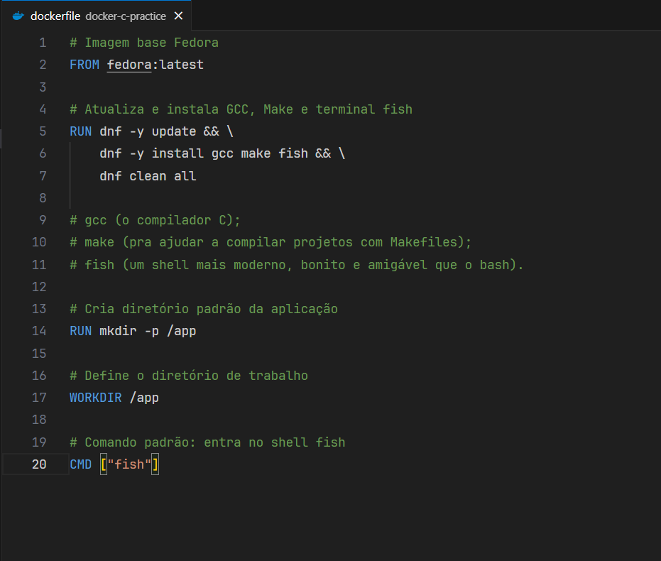

* No diretório `docker-c-practice` está contido o arquivo dockerfile e também os arquivos com os códigos-fontes em C presentes no documento [Capítulo 5 - Implementação de Tarefas](https://wiki.inf.ufpr.br/maziero/lib/exe/fetch.php?media=socm:socm-05.pdf).
* O arquivo `dockerfile` contém as instruções para a criação da imagem Docker:
    1. `FROM fedora:latest` - Usar como base a Imagem do Fedora Linux;
    2. `RUN` - Executar comandos no container
        * `dnf -y update && \` - Atualizar os Pacotes da imagem base;
        * `dnf -y install gcc make fish && \` - Instalar o compilador C `gcc` o auxiliador de compilação `make` e o terminal `fish`;
        * `dnf clean all` - Remove cache de pacotes armazenados no container durante a instalação
        * `mkdir -p /app` - Criar diretório padrão da aplicação `/app`
    3. `WORKDIR /app` - Definir diretório de trabalho `/app`
    4. `CMD ["fish"]` - Entrar no shell fish

<br>

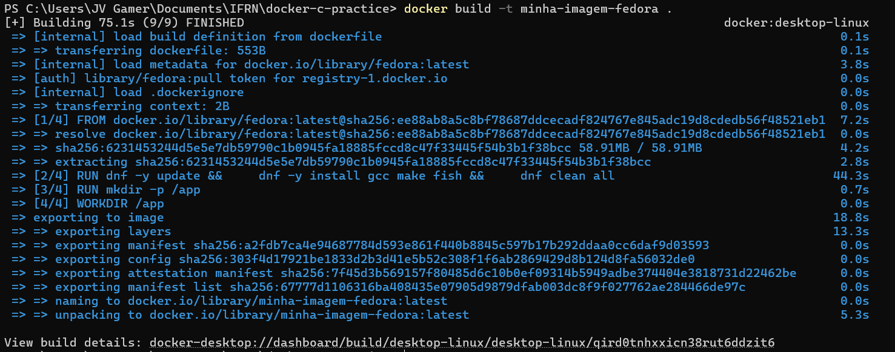


* Construir imagem no `bash` dentro do diretório `docker-c-practice` com o comando `docker build -t minha-imagem-fedora .`.
* Imagem é construida e visualizada dentro do **DockerDesktop**.

<br>

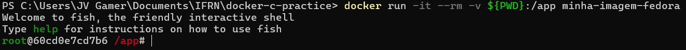


* Ainda no diretório `docker-c-practice` é inicializado o container com o comando `docker run -it --rm -v ${PWD}:/app minha-imagem-fedora`.
* Container é inicializado e visualizado dentro do **DockerDesktop**.

<br>

## Etapa 2 - Primeiros Comandos e Compilando Arquivos C

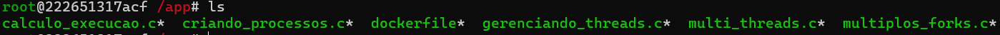

* Verificar quais arquivos estão no diretório de trabalho `/app` com o comando `ls`:
    1. **Dockerfile**
    2. **Arquivos de Código-Fonte C**

<br>

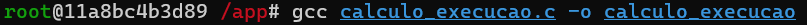

* Usando do Compilador C `gcc`é criado os executaveis de cada arquivo de código-fonte C.
    1. `gcc calculo_execucao.c -o calculo_execucao`
    2. `gcc criando_processos.c -o criando_processos`
    3. `gcc gerenciando_threads.c -o gerenciando_threads`
    4. `gcc multi_threads.c -o multi_threads`
    5. `gcc multiplos_forks.c -o multiplos_forks`

<br>

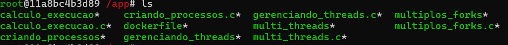

* Verificar novamente quais arquivos estão no diretório de trabalho `/app` com o comando `ls`:
    1. **Dockerfile**
    2. **Arquivos de Código-Fonte C**
    3. **Executáveis dos Códigos-Fontes C** 

<br>

## Etapa 3 - Executando Códigos-Fontes C

### Código-Fonte C
```c
#include <stdio.h>
#include <unistd.h>
#include <sys/wait.h>

int main() {
    int x = 0;

    fork();
    x++;
    sleep(5);
    wait(0);
    fork();
    wait(0);
    sleep(5);
    x++;
    printf("Valor de x: %d\n", x);

    return 0;
}
```

### Saída do Código-Fonte

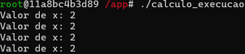

* O **primeiro** código-fonte C é o **calculo** gerado durante a **execução dos forks** criando novos processos.
    1. O Processo Pai `P0` cria um Processo Filho `P1`
    2. A variavel `X` é incrementada, dessa forma o `P0` e `P1` recebem `X` incremento +1
    3. O Processo Pai `P0` cria mais um Processo Filho `P2` e o Processo Filho `P1` cria um Processo Filho `P3` - `P2` e `P3` herdam `X = 1` de `P0` e `P1`, respectivamente.
    4. Novamente a variavel `X` é incrementada, dessa forma todos os Processos terminam com `X = 2`

<br>

### Código-Fonte C
```c
#include <unistd.h>
#include <sys/types.h>
#include <sys/wait.h>
#include <stdio.h>
#include <stdlib.h>

int main(int argc, char *argv[], char *envp[]) {
    int pid;

    pid = fork(); // cria novo processo

    if (pid < 0) {
        perror("Erro no fork");
        exit(-1);
    }
    else if (pid > 0) {
        // processo pai
        wait(0); // espera o filho
    }
    else {
        // processo filho
        execve("/bin/date", argv, envp); // substitui por outro programa
        perror("Erro no execve"); // se execve falhar
    }

    printf("Tchau!\n");
    return 0;
}
```

### Saída do Código-Fonte

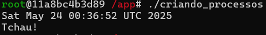

* O **segundo** código-fonte C é a **criação** de um processo que executa a funcionalidade `date` e retorna para o processo **pai**.
    1. O Processo Pai `P0` cria um novo Processo Filho `P1` e nesse contexto fica aguardando o termino de `P1`
    2. `P1` executa a sua substituição pelo programa `/bin/date` que após processado retorna a data/hora atual.
    3. Depois do termino da execução `P0` termina de executar exibindo a mensagem `Tchau!`

<br>

### Código-Fonte C
```c
#include <pthread.h>
#include <stdio.h>
#include <unistd.h>

int y = 0;

void *threadBody(void *arg) {
    int x = 0;
    sleep(10);
    printf("x: %d, y: %d\n", ++x, ++y);
    pthread_exit(NULL);
}

int main() {
    pthread_t tA, tB, tC;

    pthread_create(&tA, NULL, threadBody, NULL);
    pthread_create(&tB, NULL, threadBody, NULL);

    sleep(1);
    pthread_join(tA, NULL);
    pthread_join(tB, NULL);

    sleep(1);
    pthread_create(&tC, NULL, threadBody, NULL);
    pthread_join(tC, NULL);

    return 0;
}
```

### Saída do Código-Fonte

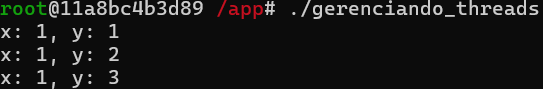

* O **terceiro** código-fonte C é a **manipulação** dos valores globais e locais de três diferentes threads.
    1. A thread `tA` e `tB` são criadas juntas em sequência, primeiro `tA` e depois `tB`
    2. Ambas threads incrementam suas variaveis locais `X` e também a variavel global `Y` - `tA` executada primeiro recebe `X = 1` e `Y = 1` e `tB` executada depois recebe `X = 1` e `Y = 2`
    3. A terceira thread `tC` é criada e também incrementada à sua variavel local `X` e novamente a variavel global `Y` +1 - `tC` possui `X = 1` e `Y= 3`
    4. Ambas threads compartilham o valor de `Y` que é incrementada sequencialmente sendo `tA` -> `tB` -> `tC` a ordem de incremento 
    5. Ambas threads possuem uma variavel local unica `X` que é incrementada apenas uma vez para cada thread

<br>

### Código-Fonte C
```c
#include <stdio.h>
#include <sys/types.h>
#include <unistd.h>
#include <stdlib.h>
#include <sys/wait.h>

#define MAX_FORKS 10  // Define um limite seguro

int main(int argc, char *argv[]) {
    if (argc < 2) {
        fprintf(stderr, "Uso: %s <numero_de_forks>\n", argv[0]);
        return 1;
    }

    pid_t pid[MAX_FORKS];
    int i;
    int N = atoi(argv[1]);

    // Garante que N não exceda MAX_FORKS
    if (N > MAX_FORKS) {
        fprintf(stderr, "Erro: Número máximo de forks é %d\n", MAX_FORKS);
        return 1;
    }

    // Garante que N não é negativo
    if (N <= 0) {
        fprintf(stderr, "Erro: N deve ser positivo\n");
        return 1;
    }

    // Código executado apenas pelo pai
    printf("[Pai] PID %d criou %d filhos\n", getpid(), N);

    for (i = 0; i < N; i++) {
        pid[i] = fork();
        
        if (pid[i] < 0) {
            perror("fork falhou");
            exit(1);
        }
        
        if (pid[i] == 0) {
            // Código executado apenas pelos filhos
            printf("[Filho %d] PID %d criado\n", i+1, getpid());
            exit(0);  // Filhos terminam aqui
        }
    }
    
    // Espera todos os filhos terminarem
    for (i = 0; i < N; i++) {
        wait(NULL);
    }

    return 0;
}
```

### Saída Código-Fonte

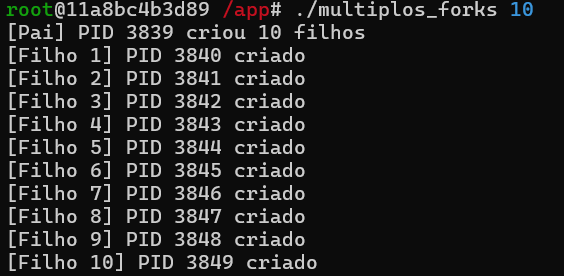

* O **quarto** código-fonte C possui um modificação realizada pelo **Deepseek** para melhor visualzação da saída. O código-fonte consiste na visualização dos PID de cada Processo Filho gerado por um Processo Pai.
    1. É mostrado o PID e a quantidade de Processos Filhos gerados pelo Processo Pai.
    2. Em seguida é mostrado de maneira sequencial cada Processo Filho e seu respectivo PID.

<br>

### Código-Fonte C
```c
#include <pthread.h>
#include <stdio.h>
#include <stdlib.h>
#include <unistd.h>

#define NUM_THREADS 5

void *print_hello(void *threadid) {
    printf("%ld: Hello World!\n", (long) threadid);
    sleep(5);
    printf("%ld: Bye bye World!\n", (long) threadid);
    pthread_exit(NULL);
}

int main() {
    pthread_t thread[NUM_THREADS];
    long status, i;

    for (i = 0; i < NUM_THREADS; i++) {
        printf("Creating thread %ld\n", i);
        status = pthread_create(&thread[i], NULL, print_hello, (void *) i);

        if (status) {
            perror("pthread_create");
            exit(-1);
        }
    }

    pthread_exit(NULL);
}
```

### Saída Código-Fonte

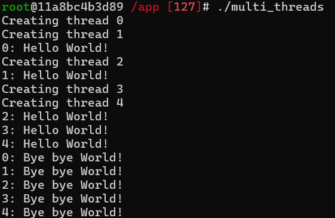

* O **quinto** código-fonte C é a criação de multiplas threads que são executadas em tempos diferentes e finalizadas juntas.
    1. O loop principal cria 4 threads que ao serem criadas, imediatamente imprimem a mensagem `i: Hello World!`
    2. Todas "dormem" por 5 segundos quase simultaneamente o que afeta em terminarem quase ao mesmo tempo
    3. Sempre imprimem a mensagem `i: Bye bye World!` de maneira sequencial `t1` -> `t2` -> `t3` -> `t4`

<br>

## Conclusão

> A atividade proporcionou uma ótima prática sobre criação de imagens **Docker** usando o **Dockerfile** fazendo o uso pertinente do tutorial passo a passo da criação, configuração e construção de uma imagem **Docker** usando o arquivo **Dockerfile**. Além disso, foi possivel praticar o conceito de tarefa e sua implementação usando códigos-fontes C e suas saídas como explicação. Essa prática deixo claro que as tarefas são muito importantes para o funcionamento dos Sistemas Operacionais possibilitando executar os aplicativos que a máquina possui de maneira controlada e organizada.
